# Neuca Chatbot - Architecture Diagrams

This file contains Mermaid diagrams for the presentation. You can render these in GitHub, VS Code with Mermaid extension, or convert to images using tools like https://mermaid.live

---

## 1. System Architecture Overview

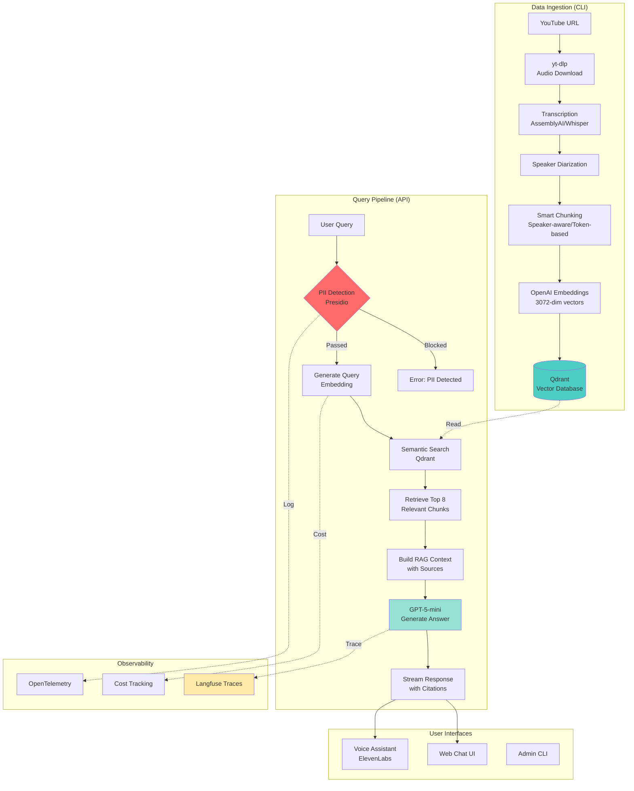

---

## 2. Data Flow: Ingestion to Knowledge

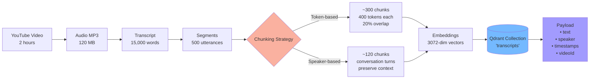

---

## 3. RAG Pipeline: Query to Answer

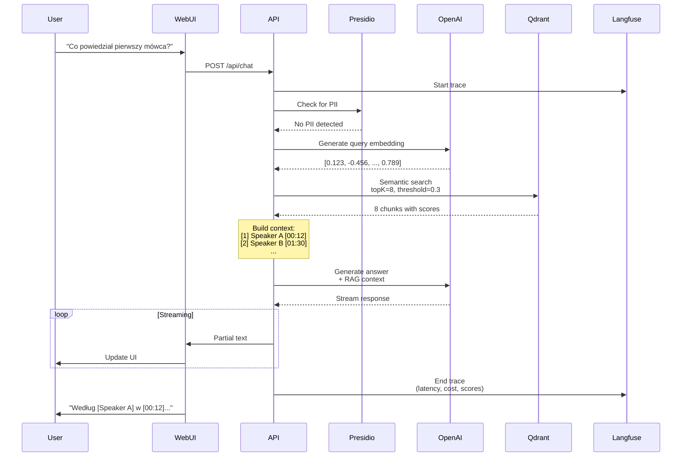

---

## 4. Trust & Compliance Framework

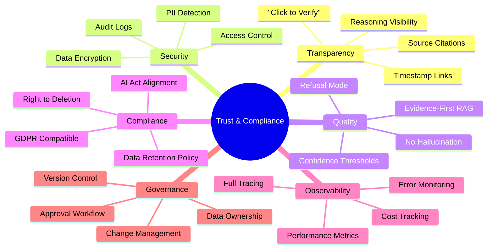

---

## 5. Content Lifecycle

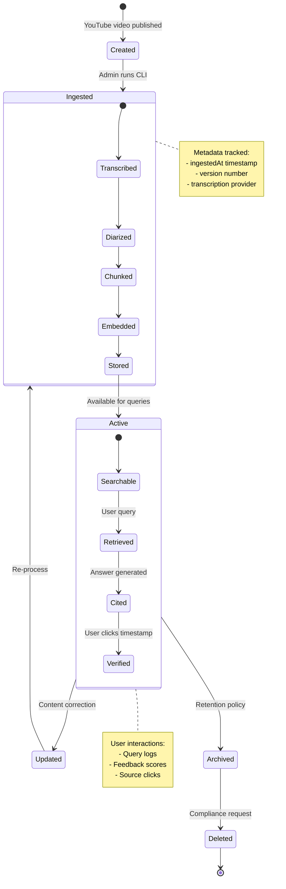

---

## 6. Scalability Architecture

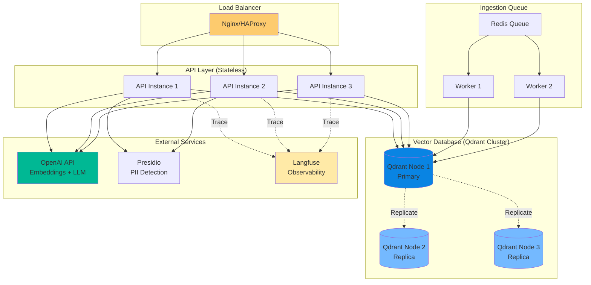

---

## 7. Security Layers

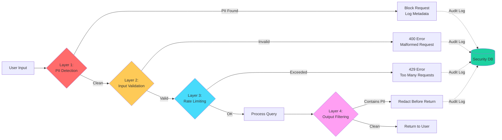

---

## 8. Observability Stack

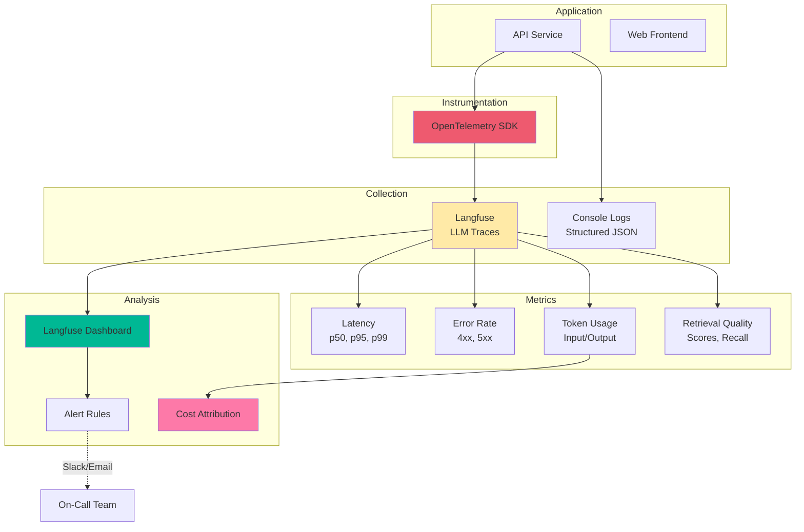

---

## 9. Multi-Lecture Architecture

```mermaid
graph TB
    subgraph "Single Qdrant Collection: 'transcripts'"
        A[Chunk 1<br/>datasetId: yt-ABC<br/>title: Panel AI<br/>speaker: A]
        B[Chunk 2<br/>datasetId: yt-ABC<br/>title: Panel AI<br/>speaker: B]
        C[Chunk 3<br/>datasetId: yt-XYZ<br/>title: Pharma Conf<br/>speaker: C]
        D[Chunk 4<br/>datasetId: yt-XYZ<br/>title: Pharma Conf<br/>speaker: D]
        E[Chunk 5<br/>datasetId: yt-123<br/>title: Training<br/>speaker: E]
    end

    Q[User Query:<br/>"Co mówił Speaker A?"]

    Q --> F{Lecture Selection}
    F -->|User picks:<br/>"Panel AI"| G[Filter:<br/>title = "Panel AI"]

    G --> H[Semantic Search]
    H --> I[Results:<br/>Chunk 1 score: 0.85<br/>Chunk 2 score: 0.72]

    style F fill:#fdcb6e
    style G fill:#e17055
    style H fill:#74b9ff
    style I fill:#00b894
```

---

## 10. Voice Assistant Flow

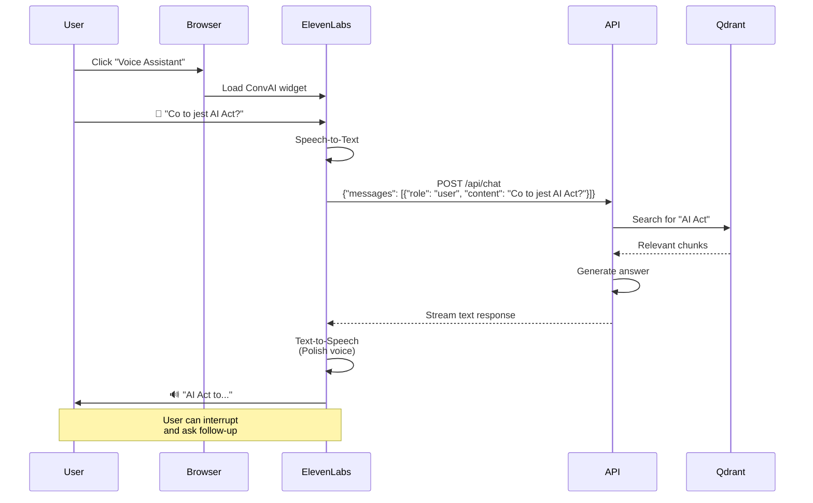

---

## 11. Pilot Rollout Phases

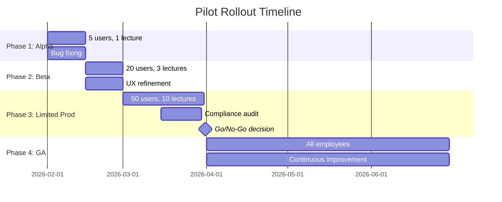

---

## 12. Decision Flow: Hallucination Prevention

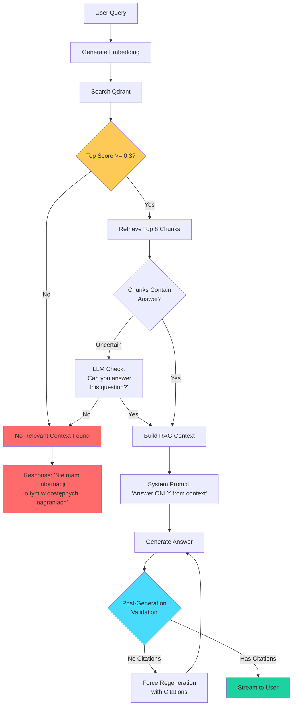

---

## 13. Cost Breakdown per Query

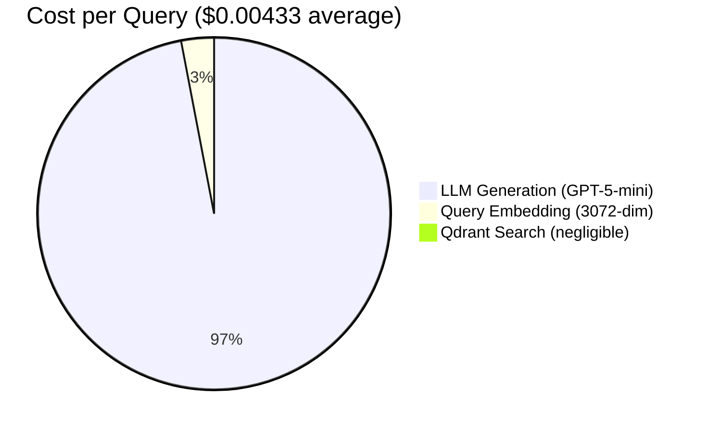

---

## 14. User Journey Map

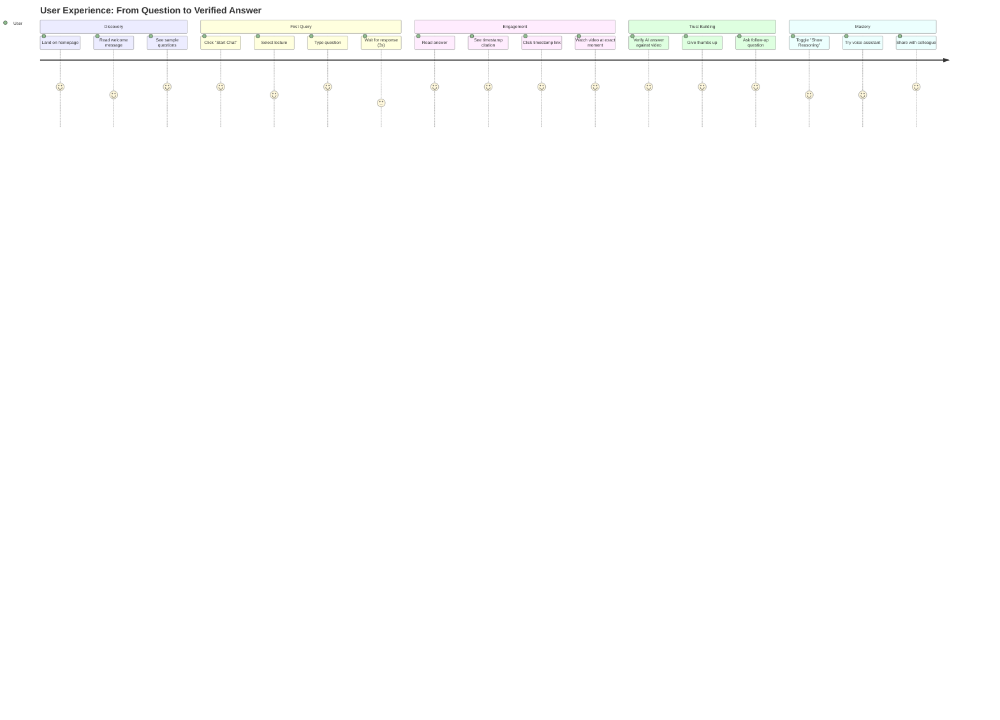

---

## 15. AI Act Compliance Checklist

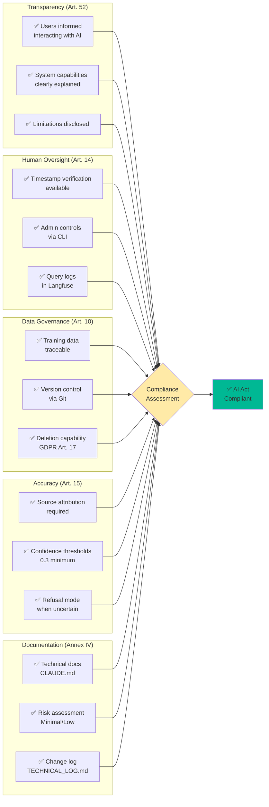

---

## Notes for Presentation

### How to Use These Diagrams:

1. **Export as Images:**
   - Go to https://mermaid.live
   - Paste each diagram code
   - Export as PNG/SVG
   - Insert into PowerPoint/Keynote

2. **Interactive Demo:**
   - Show diagrams in VS Code with Mermaid extension
   - Live-edit during Q&A if needed

3. **Slide Recommendations:**
   - Diagram 1 (Architecture): Overview slide
   - Diagram 2 (Data Flow): Technical deep dive
   - Diagram 3 (RAG Pipeline): How it works
   - Diagram 4 (Trust Framework): Compliance slide
   - Diagram 7 (Security): Security features
   - Diagram 12 (Hallucination Prevention): Quality assurance
   - Diagram 15 (AI Act): Regulatory compliance

### Animation Tips:
- Reveal architecture diagram layer by layer
- Animate sequence diagram step-by-step
- Use build animations for mindmap branches
- Highlight decision points in flowcharts
