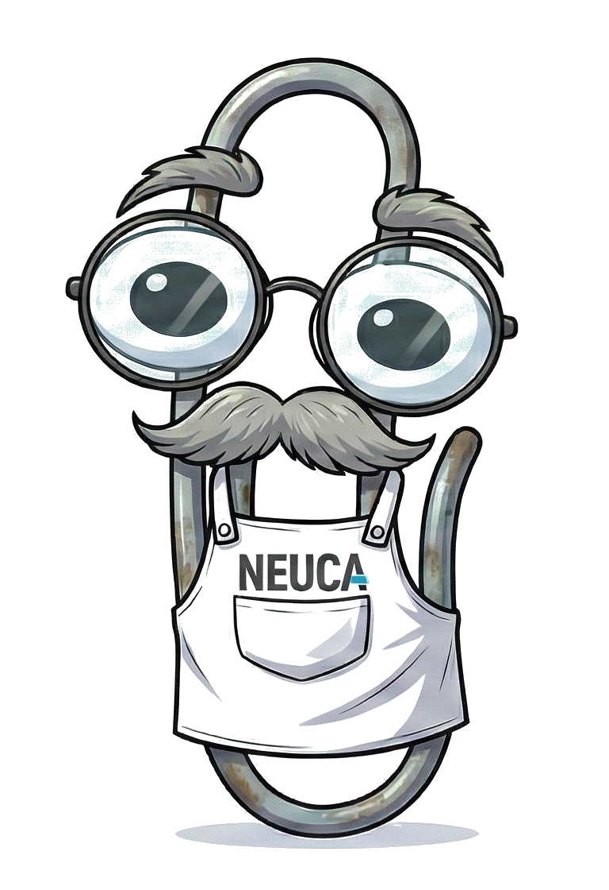

# Neuca Chatbot

<div align="center">
  
</div>

A YouTube transcription and RAG-powered chatbot system built with Bun workspaces.

## Features

- **YouTube Transcription** - Download and transcribe YouTube videos with speaker diarization
- **Multiple Transcription Providers** - AssemblyAI (cloud) or Whisper (local with GPU acceleration)
- **Speaker Identification** - Interactive tool to name speakers by listening to audio samples
- **Embedding Generation** - Create vector embeddings for RAG retrieval
- **Chat Interface** - Web UI for querying transcribed content
- **PII Detection** - Built-in privacy protection using Microsoft Presidio

## Architecture

```
neuca-chatbot/
├── apps/
│   ├── cli/          # Transcription CLI (yt-dlp + Whisper/AssemblyAI)
│   ├── api/          # Backend API (Hono + OpenAI + Qdrant)
│   └── web/          # React frontend (Vite + Tailwind)
├── packages/         # Shared code (placeholder)
├── output/           # Generated transcripts
├── temp/             # Audio cache
└── qdrant_data/      # Vector database persistence
```

### Data Flow

```
YouTube URL → yt-dlp (audio) → Whisper/AssemblyAI → Transcript with speakers
                                                            ↓
User Query ← LLM Response ← RAG Context ← Qdrant ← Embeddings ← Chunked transcript
```

## Prerequisites

- [Bun](https://bun.sh) (v1.0+)
- [Docker](https://docker.com) (for Qdrant and Presidio)
- [yt-dlp](https://github.com/yt-dlp/yt-dlp) (auto-installed by CLI)
- [ffmpeg](https://ffmpeg.org) (for audio processing)

For local Whisper transcription:
- Python 3.10+
- For Apple Silicon: `mlx-whisper` (GPU-accelerated)
- For other systems: `openai-whisper` with PyTorch

## Installation

```bash
# Clone the repository
git clone https://github.com/matjanos/neuca-chatbot.git
cd neuca-chatbot

# Install dependencies
bun install

# Copy environment template
cp .env.example .env
# Edit .env with your API keys
```

## Environment Variables

```bash
# Required for cloud transcription
ASSEMBLYAI_API_KEY=your_key_here
OPENAI_API_KEY=your_key_here

# Required for local Whisper with speaker diarization
HF_TOKEN=your_huggingface_token

# Vector database (defaults shown)
QDRANT_URL=http://localhost:6333
QDRANT_API_KEY=              # Only for Qdrant Cloud

# API server
PORT=3000

# PII Detection
PRESIDIO_ANALYZER_URL=http://localhost:5002

# Optional: Telemetry with Langfuse
LANGFUSE_PUBLIC_KEY=your_public_key
LANGFUSE_SECRET_KEY=your_secret_key
LANGFUSE_HOST=https://cloud.langfuse.com
```

## Usage

### Start Infrastructure

```bash
# Start Qdrant and Presidio
docker compose up -d qdrant presidio-analyzer
```

### CLI - Transcription

```bash
# Run the interactive CLI
bun run cli

# Menu options:
# 1. Transcribe YouTube Video
# 2. Identify Speakers
# 3. Generate Embeddings
```

The CLI guides you through:
1. **Select action** - Transcribe, identify speakers, or generate embeddings
2. **Choose provider** - AssemblyAI (cloud) or Whisper (local)
3. **Enter YouTube URL**
4. **Select language** - Polish, English, German, Portuguese, Ukrainian, Chinese, or auto-detect

### API Server

```bash
# Start the API server (development)
bun run api

# Endpoints:
# GET  /health     - Health check
# POST /api/chat   - Chat with RAG context
```

### Web Interface

```bash
# Start the web frontend
bun run web

# Open http://localhost:5173
```

### Full Stack with Docker

```bash
# Start all services
docker compose up -d
```

## CLI Commands

### Transcribe YouTube Video

1. Enter a YouTube URL
2. Select transcription provider:
   - **AssemblyAI** - Cloud API with built-in speaker diarization
   - **Whisper** - Local GPU-accelerated transcription
3. Select language (or auto-detect)
4. Transcript saved to `output/transcript-{videoId}-{timestamp}.txt`

### Identify Speakers

Post-transcription tool to replace generic speaker labels (SPEAKER_00) with names:

1. Select a transcript file
2. Listen to audio samples from each speaker
3. Enter speaker names
4. Save identified transcript

### Generate Embeddings

Convert transcripts into searchable vectors:

1. Select a transcript file
2. Choose chunking strategy:
   - **balanced** - Moderate chunk sizes
   - **detailed** - Smaller chunks for precision
   - **overview** - Larger chunks for context
3. Embeddings stored in Qdrant

Verify with:
```bash
curl http://localhost:6333/collections/transcripts
```

## Example Output

```
===========================================
NEUCA Panel Transcription
Video: What Awaits Poland in the World of AI?
URL: https://www.youtube.com/watch?v=example
Date: 2026-01-23
Duration: 45:32
===========================================

[Speaker A] (00:00:00 - 00:00:15)
Hello and welcome to today's panel discussion.

[Speaker B] (00:00:16 - 00:00:45)
Thank you for having me...
```

## Development

```bash
# Run all tests
bun test

# Run specific test file
bun test apps/cli/tests/format.test.ts

# Type check
bun run --cwd apps/cli tsc --noEmit
```

## Known Issues

1. **OpenAI Audio API** - Persistent "corrupted audio" errors. Use AssemblyAI or local Whisper instead.
2. **PyTorch MPS on Apple Silicon** - NaN values during inference. Solved by using `mlx-whisper`.
3. **Audio Playback** - macOS only (uses `afplay`).

## Documentation

- [Project Presentation](./assets/deck.pdf) - Overview presentation about the project
- [EXECUTIVE_SUMMARY.md](./EXECUTIVE_SUMMARY.md) - Executive summary and project overview
- [PRESENTATION_GUIDE.md](./PRESENTATION_GUIDE.md) - Guide for presenting the project
- [DIAGRAMS.md](./DIAGRAMS.md) - System architecture diagrams and visualizations
- [CLAUDE.md](./CLAUDE.md) - Development guidance and architecture overview
- [TECHNICAL_LOG.md](./TECHNICAL_LOG.md) - Architecture decisions and debugging notes

## License

MIT
